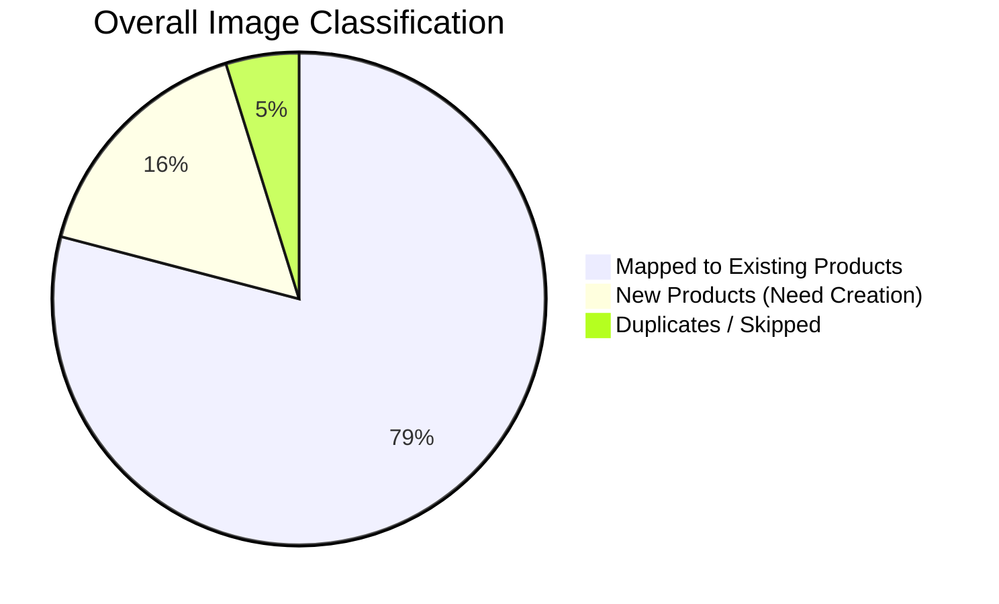
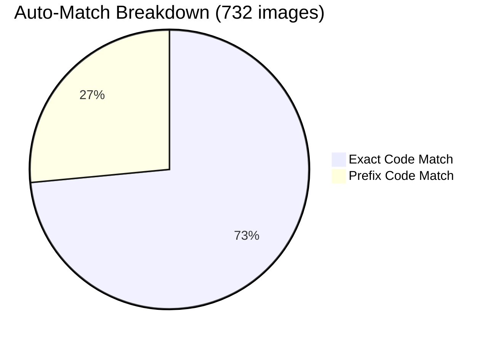
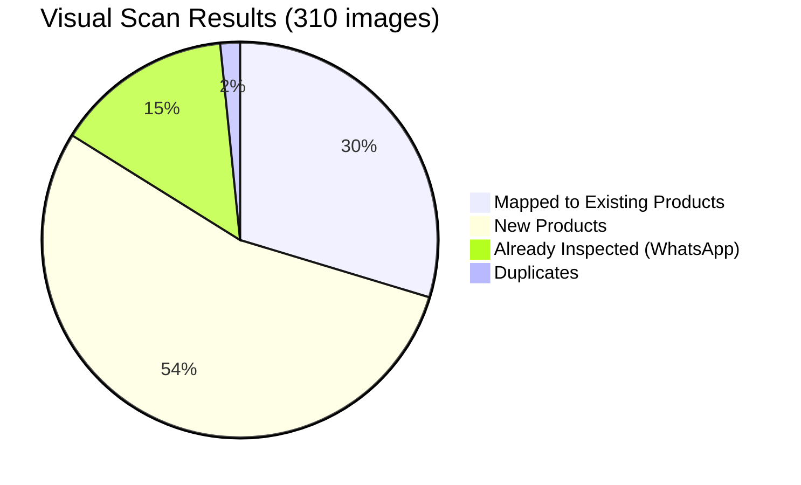
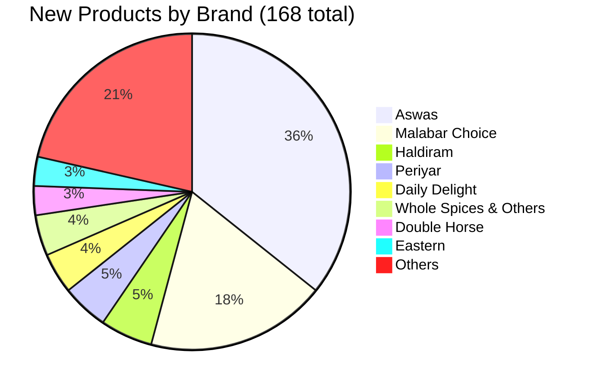
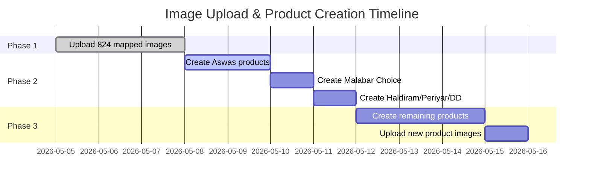

# 📦 Product Image Mapping Report

**Prepared for:** Indo Asian DC Management  
**Date:** May 5, 2026  
**Prepared by:** Technical Team  
**Subject:** Complete Analysis of 1,042 Product Images vs. Sanity Database

---

## 📊 Executive Summary



| Metric | Count | Percentage |
|--------|-------|------------|
| **Total Images Scanned** | 1,042 | 100% |
| **Auto-Matched (Exact/Prefix)** | 732 | 70.2% |
| **Visual-Scan Verified** | 92 | 8.8% |
| **Total Mapped to Existing Products** | **824** | **79.1%** |
| **New Products (Not in Database)** | **168** | **16.1%** |
| **Duplicates Found** | 7 | 0.7% |
| **Unique Images Processed** | **1,035** | **99.3%** |

---

## ✅ Phase 1: Auto-Matching Results

### Method
Images were matched against the Sanity product database using:
1. **Exact code match** — filename exactly equals product code (e.g., `VSBAN.jpeg` → `VSBAN`)
2. **Prefix code match** — product code appears at start of filename (e.g., `VSMASDOSA Masala Dosa.jpg` → `VSMASDOSA`)

### Auto-Match Results



| Match Type | Count | Confidence |
|------------|-------|------------|
| Exact Code Match | 538 | 100% |
| Prefix Code Match | 194 | 100% |
| **Auto-Match Total** | **732** | **—** |

> ✅ **These 732 images are ready for immediate upload to Sanity.**

---

## 🔍 Phase 2: Visual Scan Results

### Remaining Images After Auto-Match

| Category | Count |
|----------|-------|
| Pending visual inspection | 310 |
| WhatsApp images (generic names) | 45 |
| Descriptive filenames | 265 |

### Visual Scan Outcome



Every pending image was individually inspected. Products were identified by reading packaging labels and matching against the database.

---

## 📋 Table 1: Images Ready for Upload (824 Total)

These images have a matching product in Sanity and can be uploaded immediately.

### By Category

| Category | Images Ready | Top Brands |
|----------|-------------|------------|
| Frozen Snacks & Breads | 51 | Viswas, Daily Delight |
| Breakfast Powders | 14 | Viswas |
| Frozen Curries | 9 | Viswas |
| Frozen Vegetables | 4 | Viswas |
| Pickles | 5 | Viswas |
| Snacks (Dry) | 32 | Malabar Choice |
| Spices & Powders | 11 | Malabar Choice, Eastern |
| Cakes & Sweets | 2 | Viswas |
| Family Packs | 5 | Viswas |
| Others | 6 | Double Horse, Periyar |

### Top 10 Brands — Mapped Images

| # | Brand | Images Ready | Key Products |
|---|-------|-------------|--------------|
| 1 | **Viswas Frozen Snacks** | 44 | Banana Roast, Bonda, Cutlets, Elayada, Halwa, Jilebi, Kozhukkatta, Laddu, Neyyappam, Parippuvada, Samosa, Sughiyan, Unniyappam, Uzhunnuvada |
| 2 | **Malabar Choice** | 22 | Achappam, Avalosunda, Bombay Mixture, Butter Murukku, Cheeda Sweet, Cumin Whole, Jaggery Cube, Masala Peanut, Mixture Candy, Nadan Coffee, Pappada Boli, Peanut Candy, Rice Murukku, Sharkaravaratty, Sweet Diamond Cut, Sweet Sev, Thatta Murukku, Vermicelli, Coriander Whole |
| 3 | **Viswas Frozen Breakfast** | 22 | Steamed Banana, Veg Biriyani, Masala Dosa, Palappam with Stew, Pathiri, Veg Pulao, Puttu with Kadala, Idiyappam, Malabar Porotta, Catering Porotta |
| 4 | **Viswas Frozen Curries** | 9 | Avial Curry, Chakkakuru Mango Curry, Chakkakuru Mezhukkuvaratty, Chakkakuru Thoran, Cheerathoran, Idichakka Thoran, Koottu Curry, Pavakka Thoran, Pavakka Theyal |
| 5 | **Viswas Breakfast Powders** | 7 | Dosa Podi, Upma Mix, Palappam Mix, Puttu White, Puttu Chemba, Rice Flour, Roasted Rava |
| 6 | **Viswas Family Pack** | 4 | Banana Fry 908g, Veg Cutlet Family, Neyyappam Family, Unniyappam Family |
| 7 | **Viswas Frozen Vegetables** | 4 | Arvi, Gooseberry, Grated Coconut, Green Chilli |
| 8 | **Double Horse** | 3 | Meat Masala, Ponni Rice 5kg, Vermicelli |
| 9 | **Eastern** | 1 | Tamarind 500g |
| 10 | **Others** | 8 | Pickles, Cakes, Spices |

---

## 🆕 Table 2: New Products Requiring Creation (168 Total)

These products **do not exist** in the current Sanity database. New product entries must be created before their images can be uploaded.

### By Brand



| # | Brand | New Products | Priority |
|---|-------|-------------|----------|
| 1 | **Aswas** | 60 | 🔴 High |
| 2 | **Malabar Choice** | 31 | 🔴 High |
| 3 | **Haldiram** | 9 | 🟡 Medium |
| 4 | **Periyar** | 8 | 🟡 Medium |
| 5 | **Daily Delight** | 7 | 🟡 Medium |
| 6 | **Whole Spices & Others** | 7 | 🟡 Medium |
| 7 | **Double Horse** | 5 | 🟡 Medium |
| 8 | **Eastern** | 5 | 🟡 Medium |
| 9 | **Frozen Breakfast & Porotta** | 4 | 🟡 Medium |
| 10 | **Viswas (Various)** | 6 | 🟡 Medium |
| 11 | **Pickles** | 4 | 🟢 Low |
| 12 | **Others** | 22 | 🟢 Low |

### Aswas — Complete Product List (60 New Products)

All Aswas products are **frozen ready-to-eat / ready-to-cook** items. None exist in Sanity.

#### Non-WhatsApp Images (15 products)

| # | Product Name | Image File |
|---|-------------|------------|
| 1 | Aswas Sambar Mix | `ASAMMIX.jpeg` |
| 2 | Aswas Chappathi | `ASCHAPPATHI.jpeg` |
| 3 | Aswas Cut Mango | `ASCUTMAN.jpeg` |
| 4 | Aswas Ginger | `ASGING.jpeg` |
| 5 | Aswas Gooseberry | `ASGOOS.jpeg` |
| 6 | Aswas Idiyappam | `ASIDI.jpeg` |
| 7 | Aswas Idiyappam (Brown) | `ASIDIYAB.jpeg` |
| 8 | Aswas Jackfruit Green Sliced | `ASJACKGREESLI.jpeg` |
| 9 | Aswas Jackfruit Seed | `ASJACKSEED.jpeg` |
| 10 | Aswas Jackfruit Whole | `ASJACKWHOLE.jpeg` |
| 11 | Aswas Okra | `ASOKRA.jpeg` |
| 12 | Aswas Tapioca Sliced | `ASSLITAP.jpeg` |
| 13 | Aswas Tapioca Whole | `ASTAP.jpeg` |
| 14 | Aswas Wheat Porotta | `ASWHEAPORA.jpeg` |
| 15 | Aswas Kozhukkatta | `aswas kozhukkatta.jpg` |

#### WhatsApp Images (45 products — Photographed Feb 27, 2026)

| # | Product Name | # | Product Name | # | Product Name |
|---|-------------|---|-------------|---|-------------|
| 1 | Sambar Mix | 16 | Neyyappam | 31 | Gingelly Balls |
| 2 | Chappathi | 17 | Unniyappam | 32 | Banana Chips |
| 3 | Chilli Chutney | 18 | Uzhunnuvada | 33 | Spicy Banana Chips |
| 4 | Coconut Chutney | 19 | Vegetable Samosa | 34 | Ripe Banana Chips |
| 5 | Cut Mango Pickle | 20 | Avial Curry | 35 | Rice Murukku |
| 6 | Ginger Pickle | 21 | Chakkakuru Mango Curry | 36 | Spicy Garlic Murukku |
| 7 | Gooseberry Pickle | 22 | Chakkakuru Thoran | 37 | Kerala Mixture |
| 8 | Idichakka Thoran | 23 | Cheerathoran | 38 | Spicy Kerala Mixture |
| 9 | Idiyappam White | 24 | Koottu Curry | 39 | Roasted Rava |
| 10 | Idiyappam Brown | 25 | Pavakka Thoran | 40 | Maida |
| 11 | Jackfruit Green Sliced | 26 | Pavakka Theyal | 41 | White Rice Flakes |
| 12 | Jackfruit Seed | 27 | Banana Roast | 42 | Roasted Rice Flakes Brown |
| 13 | Jackfruit Whole | 28 | Banana Fry | 43 | Spicy Ring Murukku |
| 14 | Okra Cut | 29 | Bonda | 44 | Tomato Murukku |
| 15 | Tapioca Whole | 30 | Coconut Bun | 45 | Roasted Vermicelli |

> 📸 **Note:** WhatsApp images are product photos taken on February 27, 2026. Most are 1600×1120px or 2048×1433px. Product names were identified directly from packaging.

### Malabar Choice — New Export-Line Products (15 products)

These feature modern white packaging with multilingual labels (English, German, French, Tamil, Malayalam, Hindi) — distinct from existing Malabar Choice products in the database.

| # | Product Name | Packaging Line |
|---|-------------|----------------|
| 1 | Banana Chips | Slices of Heaven |
| 2 | Spicy Banana Chips | Slices of Heaven |
| 3 | Ripe Banana Chips | Slices of Heaven |
| 4 | Rice Murukku | The Crisp South Indian Twist |
| 5 | Spicy Garlic Murukku | The Crisp South Indian Twist |
| 6 | Spicy Ring Murukku | The Crisp South Indian Twist |
| 7 | Tomato Murukku | The Crisp South Indian Twist |
| 8 | Kerala Mixture | Classic Crunchy Mix |
| 9 | Spicy Kerala Mixture | Classic Crunchy Mix |
| 10 | Gingelly Balls (Sesame Balls) | — |
| 11 | Roasted Rava (Semolina) | Premium Quality |
| 12 | Maida (All Purpose Flour) | Premium Quality |
| 13 | White Rice Flakes | Premium Quality |
| 14 | Roasted Rice Flakes Brown | Premium Quality |
| 15 | Roasted Vermicelli | Premium Quality |

### Haldiram — New Products (9 products)

| # | Product Code | Product Name |
|---|-------------|-------------|
| 1 | HDBOONDI | Haldiram Boondi |
| 2 | HDFOXNUTSALTANDPEPPER | Foxnut Salt & Pepper |
| 3 | HDGUJARATIMIX | Gujarati Mix |
| 4 | HDKHARIMETHI | Khari Methi |
| 5 | HDLONGSEV | Long Sev |
| 6 | HDMURUKKU | Murukku |
| 7 | HDNAVARATNA | Navaratna Mix |
| 8 | HDNIMBUMASALA | Nimbu Masala |
| 9 | HDPANCHRATTAN | Panchrattan |

### Other Notable New Products

| Brand | Product Code | Product Name |
|-------|-------------|-------------|
| Eastern | ESTBLA | Black Chana |
| Eastern | ESTFI | Fish Pickle |
| Eastern | ESTPR | Prawn Pickle |
| Eastern | ESTCHC | Chick Peas 1kg |
| Eastern | ESTCUM | Cumin Seed 100g |
| Double Horse | DHPAT2-M | — |
| Double Horse | DHPUTTUODI1W1KG | Puttu Odi 1kg |
| Double Horse | DHUNRIC | Unroasted Rice |
| Double Horse | DHVERL-M | Vermicelli Long |
| Double Horse | DHVINEGAR-M | Vinegar |
| Periyar | ADA-M | Ada |
| Periyar | CUM-M | Cumin |
| Periyar | CUMI200 | Cumin 200g |
| Periyar | DESICF1 | Desiccated Coconut |
| Periyar | DESICF5 | Desiccated Coconut 5kg |
| Periyar | DESIM500 | Desi Mix 500g |
| Periyar | DRYSHECH | Dry Shrimp |
| Periyar | VER-M | Vermicelli |
| GRB | GEBPINEHAL | Pineapple Halwa |
| India Gate | IGBASMATU5 | Basmati Rice 5kg |
| Marine Sea Fresh | MSJAPANE600 | Japanese Mackerel 600g |
| Marine Sea Fresh | MSMACKE600 | Mackerel 600g |
| Marine Sea Fresh | MSSPH | Seer Fish |
| Neptune | NP531 | Product 531 |
| Neptune | NPKIN1.2 | King Fish 1.2kg |
| Neptune | NPSQRI | Squid |
| Shana | SHACHIANDGAR-M | Chilli & Garlic |
| Shana | SHAP | — |
| Melam | MELINSTPAL-M | Instant Palappam |
| Melam | MLWHI-M | White — |
| Tasty Nibbles | TNKCCHILPO | Chilli Powder |
| Crispy | CRRITEARUR | — |

---

## 📁 Image Folder Structure

Images are organized across 23 brand/category folders:

```
PRODUCTS LIST/
├── Aswas/                          (60 images — all new)
├── Bottle snacks/                  (3 images — all new)
├── Breakfast powders/              (7 images — all mapped)
├── Crispy/                         (1 image — new)
├── Daily Delight/                  (7 images — all new)
├── Double Horse/                   (8 images — 3 mapped, 5 new)
├── Dry snacks/                     (1 image — new)
├── Eastern/                        (6 images — 1 mapped, 5 new)
├── Frozen Breakfast/               (8 images — 7 mapped, 1 new)
├── Frozen Breakfast and Porotta/   (15 images — 11 mapped, 4 new)
├── Frozen curries/                 (11 images — 9 mapped, 2 new)
├── Frozen vegetables/              (7 images — 4 mapped, 3 new)
├── GRB/                            (1 image — new)
├── HALDIRAM/                       (9 images — all new)
├── India Gate/                     (1 image — new)
├── MARINE SEA FRESH/               (3 images — all new)
├── Malabar Choice Images/          (53 images — 22 mapped, 31 new)
├── Melam/                          (2 images — all new)
├── NEPTUNE FROZEN FRESH/           (3 images — all new)
├── Periyar/                        (8 images — all new)
├── Pickles/                        (5 images — 1 mapped, 4 new)
├── SHANA/                          (2 images — all new)
├── TASTY NIBBLES/                  (1 image — new)
├── Viswas frozen snacks/           (25 images — 22 mapped, 3 new)
├── Whole spices & others/          (7 images — all new)
├── cakes/                          (1 image — mapped)
└── family pack/                    (5 images — 4 mapped, 1 new)
```

---

## 🎯 Recommended Action Plan

### Immediate Actions (Week 1)

| Priority | Action | Images | Effort |
|----------|--------|--------|--------|
| 🔴 **High** | Upload 824 mapped images to Sanity | 824 | 2-3 days |
| 🔴 **High** | Create 60 Aswas products in Sanity | 60 | 1-2 days |

### Short-Term (Week 2)

| Priority | Action | Products | Effort |
|----------|--------|----------|--------|
| 🔴 **High** | Create 31 Malabar Choice products | 31 | 1 day |
| 🟡 **Medium** | Create 9 Haldiram products | 9 | 2-3 hours |
| 🟡 **Medium** | Create 8 Periyar products | 8 | 2 hours |
| 🟡 **Medium** | Create 7 Daily Delight products | 7 | 2 hours |

### Medium-Term (Week 3)

| Priority | Action | Products | Effort |
|----------|--------|----------|--------|
| 🟡 **Medium** | Create remaining 63 products (various brands) | 63 | 2-3 days |
| 🟢 **Low** | Upload images for all newly created products | 168 | 1 day |

### Total Timeline Estimate



**Estimated completion:** 10-12 business days

---

## 📎 Supporting Documents

| Document | Description | Location |
|----------|-------------|----------|
| **VERIFIED_IMAGE_MAPPING.md** | Complete list of 824 image-to-product mappings | `docs/kimi/` |
| **VISUAL_SCAN_REPORT.md** | Detailed visual scan with all 260 pending images | `docs/kimi/` |
| **IMAGE_MAPPING_REVIEW.md** | Original review document | `docs/kimi/` |

---

## ✅ Approval Checklist

- [ ] Review mapped products (Table 1) — 824 images
- [ ] Approve new product list (Table 2) — 168 products
- [ ] Confirm priority order for product creation
- [ ] Authorize Phase 1: Upload 824 images to Sanity
- [ ] Authorize Phase 2: Create new products in Sanity

---

*For questions or clarifications, please contact the technical team.*

**End of Report**
